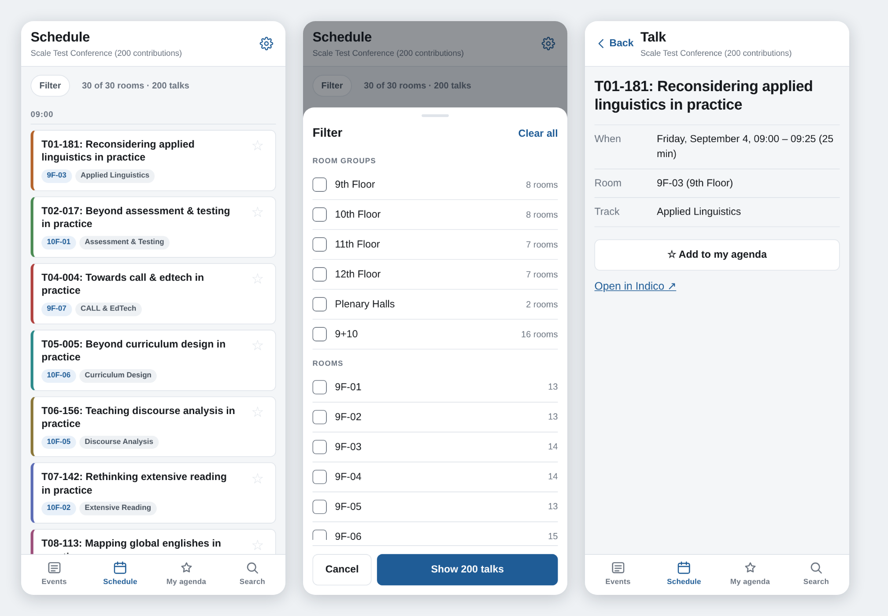

# indico-schedule-app

An installable mobile web app for reading an Indico **Block Schedule** offline.

It is a plain static site. It is **not** an Indico plugin: nothing is installed
into Indico, no database table is created, and no Python runs. nginx serves a
directory of files from the Indico host, and the app reads the Block Schedule
plugin's existing `grid-data` endpoint.



## Why this is so small

**Same origin.** The app is served from the Indico host, so the browser
attaches the user's existing `indico_session` cookie to every request by
itself. That single decision removes the login screen, the token storage, the
refresh handling and the CORS negotiation — signing in is Indico's own login
page, and the app just links to it.

**The data already exists.** `GET /event/<id>/block-schedule/grid-data?day=…`
returns rooms, groups, tracks, talks, speakers, times and colours in one
document, on Indico's standard display request handler — so access control is
inherited exactly. Public events answer to anyone; protected ones answer to
permitted users.

**The grid becomes a list.** Thirty rooms do not fit in 390 pixels. The phone
shows the same information as a time-ordered agenda, with search and filtering
as the primary navigation, rather than a shrunken and unreadable grid.

## What it does

- **Events** — a library of conferences, **picked from Indico's own category
  tree or its search**, never typed as a URL: the app is served by Indico, so it
  already knows which server it is talking to. Only events that actually have a
  block schedule are offered. Each is cached separately and stamped with how
  fresh it is
- **The organisation's logo** at the top of the library, taken from Indico's
  own page header, so the app carries whatever branding the server already
  shows
- **Schedule** — a day's talks in time order, with a "now" marker, room and
  track labels, and day tabs for multi-day events. Tracks carry the colour their
  event manager chose, falling back to a generated palette where none was set
- **Filter** — by room group, individual room, or track, reusing the plugin's
  own rules and URL parameters, so a filtered link works in the app *or* the
  web page
- **Search** — titles, speakers, rooms, sessions and tracks, run entirely
  against the local copy
- **Talks** — full **abstracts and speaker affiliations, offline**, fetched
  from Indico's export API because the schedule payload only carries a preview
  sized for a grid cell. Formatting survives through an allow-list; anything
  else is dropped
- **Event logos** — each event's own logo from Indico's Layout page, on its card
  in the library. Stored on the device like everything else, and simply absent
  when the organisers set none
- **Sponsors** — the event's sponsors on the schedule screen, above the day's
  talks or below them as the event manager chose, sized by the
  same tier rule the web page uses and with their logos stored on the device, so
  they are there offline. Comes from the Event Sponsors plugin, which is
  optional: an event without it simply has no block
- **My agenda** — starred talks across every event. Talks that have already
  finished are out of the way behind a "Show finished" button, since an agenda
  is mostly used to find out where to go *next*; talks that overlap are boxed
  together with the window they collide in, so the useful fact — which two you
  have double-booked — is the one on screen
- **Offline** — everything above works with no connection, from a cold start
- **Install guidance** — until it is running from a home-screen icon the app
  raises a sheet by itself, once, with the instruction that actually applies:
  Chrome's native install dialog where that exists, Safari's Share menu on iOS,
  and on an insecure origin the reason installation is unavailable at all

## Three things to know

**Refresh happens once, at startup.** There is no background timer. Every other
refresh is one the user asked for: the Refresh control on an event, or adding
an event. This is deliberate — a schedule changes a handful of times over a
conference, and on iOS a background timer would not run anyway.

**Starred talks live on this device.** Indico 3.3.12 has nowhere to store a
per-user starred contribution — the core favourites API arrived after it. The
app says so rather than letting anyone assume their agenda is on the server.
Indico 3.3.13+ makes syncing possible; see the plans in
`dev-docs/indico-blockschedule/mobile-app/`.

**HTTPS is required for the good parts.** Service workers only exist in a
secure context, so over plain `http://` (other than localhost) there is no
offline start and no home-screen install — the app degrades to an ordinary
website, logs a console warning, and shows a card saying installation is
impossible over http:// rather than offering a button that cannot work.

## Feeling like an app rather than a page

Deliberate, and worth keeping if the UI is reworked:

- **Press feedback on everything tappable** — a 90 ms scale-down on rows,
  cards, chips and buttons. Native controls acknowledge a finger before
  anything else happens; skipping this is most of why web apps feel dead.
- **Directional screen transitions** — deeper screens slide in from the right
  and back out to the left; sibling tabs cross-fade instead, because sliding
  between peers is what makes navigation feel like it is guessing.
- **The filter sheet rises** into place rather than appearing.
- **Pull to refresh**, with resistance so the gesture feels like stretching
  something. It replaces the browser's own, which `overscroll-behavior` has
  already suppressed.
- **Scroll position is restored** per screen. Returning from a talk to the top
  of a 200-row schedule is the most page-like thing an app can do.
- **No long-press callouts or text selection on controls** — content stays
  selectable.
- Every one of these is disabled under `prefers-reduced-motion`, keeping the
  colour feedback and dropping the movement.

## Development

```bash
npm install
npm run dev            # http://localhost:5173/schedule-app/
```

The dev server proxies `/event`, `/api`, `/login`, `/export`, `/search`,
`/category`, `/images`, `/static` and `/` itself to the Indico instance, so the
app is single-origin in development too. `/` is matched exactly (a regex proxy
key) because the logo is read out of Indico's home page, and a plain `/` prefix
would swallow the app and its own assets. Point it elsewhere with
`INDICO_URL=https://indico.example npm run dev`. Localhost counts as a
secure context, so the service worker runs in development exactly as it will in
production.

```bash
npm run typecheck      # tsc, strict
npm run build          # dist/, including the precache manifest and stamped sw.js
npm run icons          # regenerate the PWA icons (needs Playwright)
```

## Verifying

```bash
npx vite preview --port 4173 --host 127.0.0.1 &
python3 scripts/verify.py --event <id> [--multiday-event <id>] \
    [--no-schedule-event <id>] [--insecure-base http://<lan-ip>:4174]
```

Sixty-seven checks against a real Indico instance, asserted numerically —
rendered row counts against the payload, the contents of IndexedDB, the service
worker's state, and a full offline cold start. "It looked right" is how offline
bugs survive review, so nothing here is judged by eye.

Two of them need conditions the calendar will not supply on demand, so the
script makes them: the agenda's finished-talk filter is exercised by swapping
the page's `Date` for a fixed one mid-conference, and the clash box by starring
two talks that genuinely start at the same minute, found in the payload rather
than hardcoded.

`scripts/screenshots.py` writes one PNG per screen, in light or `--dark` mode,
for when a change does need looking at.

## Deploying

**See [DEPLOY.md](DEPLOY.md)** — copy a directory, add an nginx block, done.

A ready-to-copy `schedule-app-<build>.tar.gz` is built already. To make a new
one:

```bash
npm ci && npm run package    # build + tarball, with the copy commands printed
```

On the Indico host itself, `./deploy/deploy.sh` does the build and install in
one go instead. Either way the nginx part is deliberately not automated: the
vhost is shared with Indico.

## Where each piece of data comes from

Indico endpoints, none of them added for this app except the last, which belongs
to a plugin that is optional and answers 404 when an event has not enabled it:

| What | Endpoint |
|---|---|
| The schedule | `/event/<id>/block-schedule/grid-data?day=…` (the plugin) |
| Each event's logo | `event_logo_url` in that payload → `/event/<id>/logo-<hash>.png` |
| Abstracts, affiliations | `/export/event/<id>.json?detail=contributions` |
| Browsing for events | `/category/<id>/info` + `/export/categ/<id>.json` |
| Searching for events | `/search/api/search?q=…&type=event` |
| The organisation logo | the `` on `/` |
| Sponsors | `/event/<id>/sponsors/data` (the Event Sponsors plugin, optional) |

Two things worth knowing about the abstract source. Indico only exports
contributions once the organisers have **published** them, so an unpublished
event yields no abstracts — the app says "no abstract was published" rather than
inventing a reason. And the legacy export is server-cached for ten minutes, so a
newly published abstract takes that long to appear; the app does not try to
defeat that cache, since it is what protects the server from a room full of
phones.

## Two questions Indico will not answer

**Which events have a block schedule?** Nothing advertises it. The plugin's
endpoint answers for *every* event — one with no schedule simply returns no
columns — so the only way to know is to ask, one event at a time. That is why
the picker fills in gradually rather than arriving complete: it checks a batch
of the listing at a time, three requests in flight at most, and shows each event
once its answer comes back. Answers are stored, so an event is asked about once;
a "no" is re-checked after a day, in case a schedule appeared in the meantime.
The same rule is enforced in `addEvent`, so adding by id cannot slip past it.

The honest cost: `grid-data` builds a whole day's payload server-side, so a
category of 200 events cannot be checked in one go and is not attempted. If the
plugin ever grew a one-request "which of these events have schedules?" endpoint,
this whole file could collapse into a single call.

**What is the organisation's logo?** `LOGO_URL` is a server setting that reaches
exactly one place: the `` in Indico's page header. So
the app reads the home page once a week and lifts the logo out of it with
`DOMParser` — no HTML is ever inserted into the app, only an attribute is read.
The image is kept as a blob, so the logo is there on a cold offline start.

It is also *measured*. Indico's own default header logo is solid white, which on
a pale background is indistinguishable from having no logo at all; the app draws
the image to a canvas, averages the luminance of its non-transparent pixels, and
puts a dark plate behind anything light. If core's header markup ever changes,
the logo quietly disappears and nothing else does.

**A third, smaller one: what time is it where the conference is?** The payload
gives times as the event's own wall clock with no zone attached, so "has this
talk finished?" is answered against the device's clock. At the conference those
are the same clock. Reading next week's agenda from three time zones away is
where the boundary can be an hour or two out — which is why finished talks are
hidden behind a button rather than discarded.

## The contract with the plugin

`src/types.ts` and `src/filters.ts` are copies of the Block Schedule plugin's
own files, because the JSON is the contract between two separate projects and
the app has to build without the plugin checked out. The cost is that they can
drift. Fields the plugin adds later are typed as optional here — `tracks[].color`
and `event_logo_url` both arrived after plugin 0.1.2, and a schedule cached from
an older server has no such key — so a payload from either version renders. `looksLikeGridData` fails loudly rather than rendering nonsense if the
payload loses a field the app needs, and the plugin should carry a test
asserting the keys listed in `REQUIRED_KEYS`.

One optional courtesy on the plugin side: `grid-data` sets no ETag, so a
refresh always re-downloads the payload. The app already sends `If-None-Match`
and handles 304, so three lines in the plugin's handler would make refreshes
nearly free, with no change here.

## Layout

```
src/
  api.ts          talking to Indico; errors classified so the UI can respond
  db.ts           IndexedDB: events, cached days, stars
  sync.ts         startup refresh and per-event refresh
  store.ts        a revision counter components subscribe to
  hooks.ts        read stored data, re-read when it changes
  filters.ts      room/group/track filtering (ported from the plugin)
  search.ts       local search and match highlighting
  router.ts       five routes, hand-rolled
  install.ts      whether it is installed, promptable, or why neither
  probe.ts        which events have a block schedule, asked once and remembered
  branding.ts     the site logo, lifted from Indico's page header and measured
  richtext.tsx    abstracts rendered through an HTML allow-list, never raw
  components/     one file per screen, plus TalkRow and the filter sheet
public/
  sw.js           precaches the shell; deliberately does not cache the API
  manifest.webmanifest
deploy/           nginx snippet and an install script
scripts/          build, icons, verification, screenshots
```
